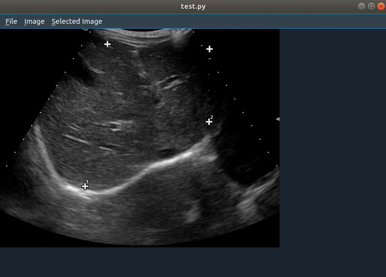
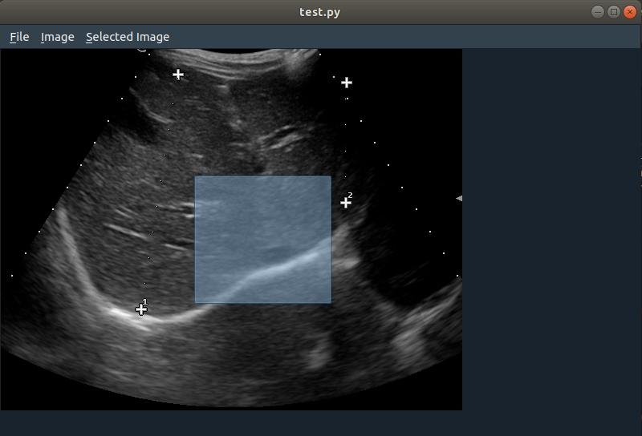
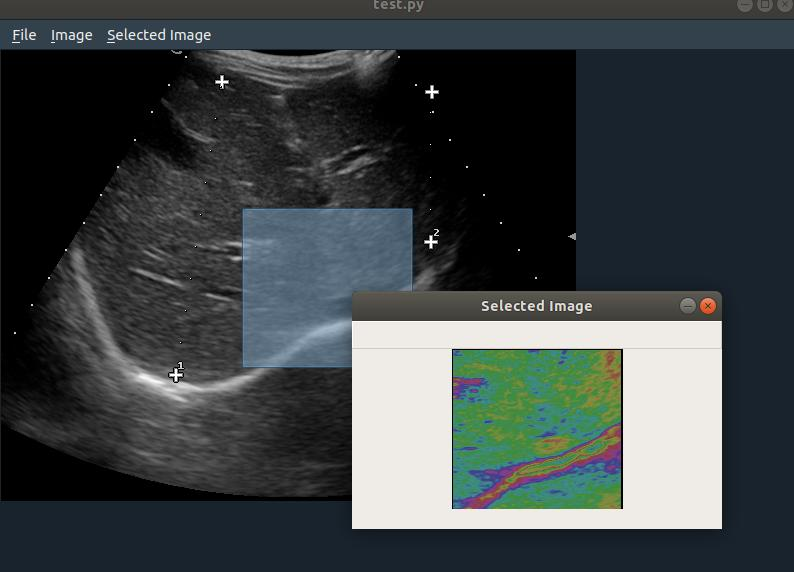
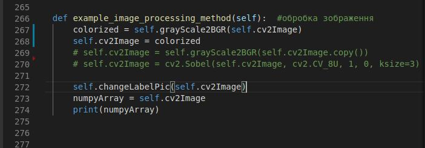

# PyQt5-ImageViewer-opencv

# This application can help testing different image processing algorithms 
# Navigation: 
## 1) Open the image
### <b> File -> Open</b> 

## 2) Apply image processing algorithm
### <b> Image -> Example image processing</b> 

## 3) Save the image
### <b> File -> Save</b>

## 4) Select rectangle area
### <b> just select using a mouse </b>

## 5) You can apply processing for the selected area:
### You can apply few different methods in a row:

### <b> Selected Image -> Raise contrast </b>
### <b> Selected Image -> Colorize </b>
### To see the result:
### <b> Selected Image -> Show </b>

 
## Save selected(processed or not) image:
### <b> Selected Image -> SaveSelected </b>

## 6) Easily apply your own image processing algorithm
### Also, you can add other methods of image processing, and create additional buttons for menu, or just replace method for existing button, for example ou can do any manipulations with self.cv2Image to apply your own image processing algorithm:

 

